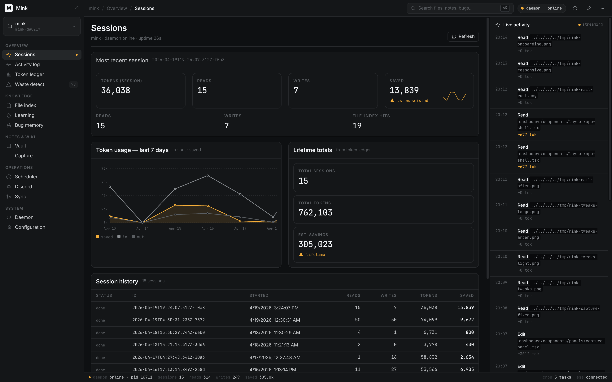
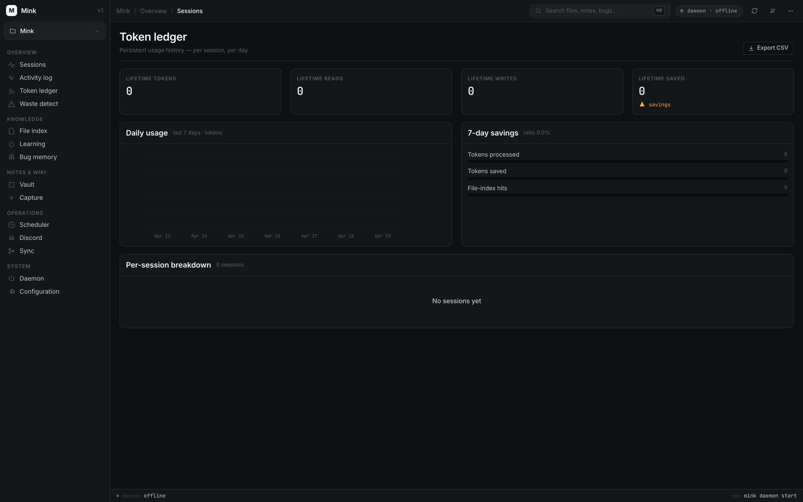
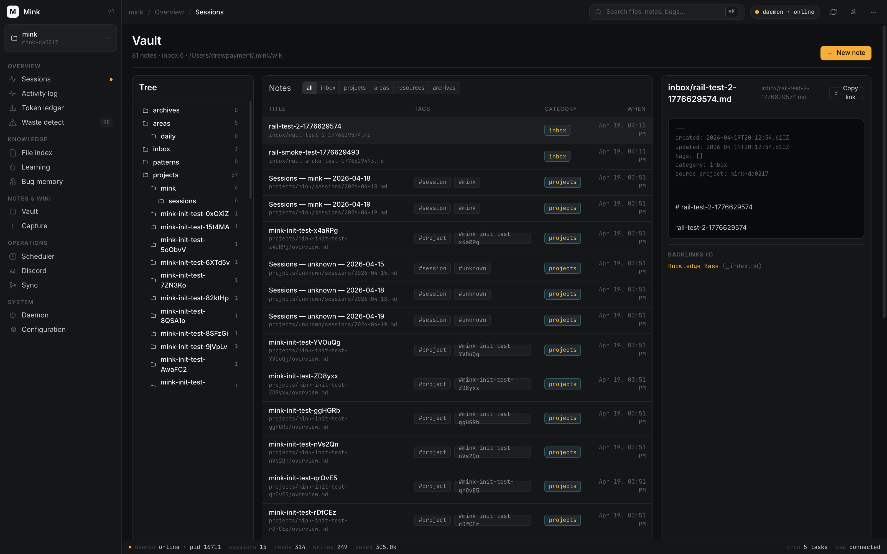
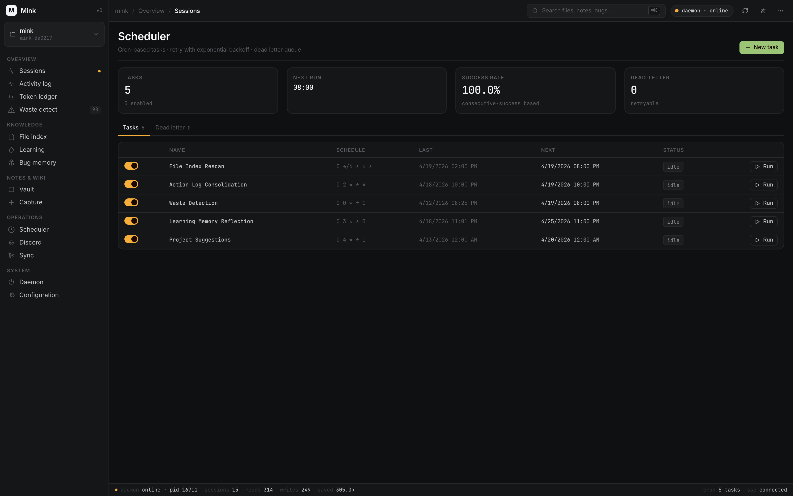
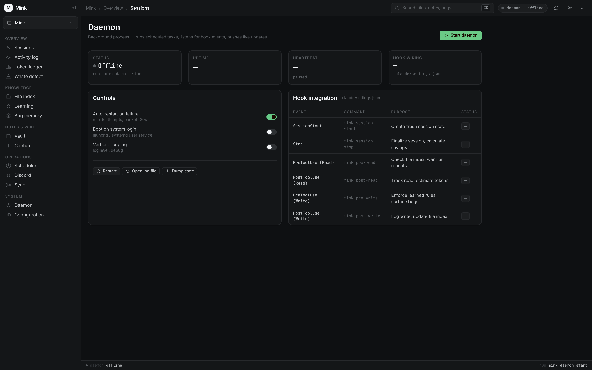
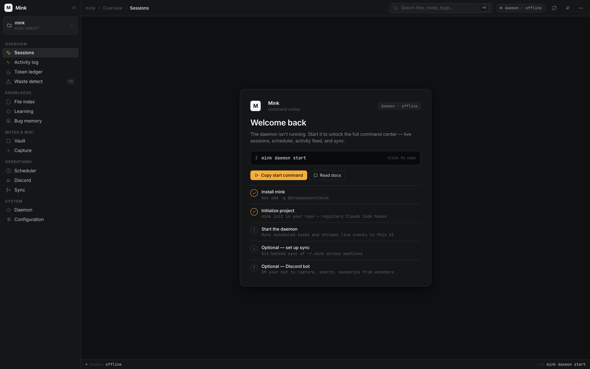

# Mink

A hidden presence that moves alongside the developer.

Mink is a lightweight companion for AI coding assistants like [Claude Code](https://claude.ai/code). It hooks into the assistant's lifecycle events to reduce token waste, enforce learned rules, and build a portable knowledge base across all your projects.

## Why Mink?

AI coding assistants consume tokens every time they read a file, write code, or reason about your project. Much of this is redundant: re-reading files already seen, repeating mistakes that were already corrected, and lacking context that was available in a previous session.

Mink intercepts these lifecycle events and maintains structured state so the assistant can work smarter:

- **Track what was already read** and warn before redundant re-reads
- **Remember past mistakes** and surface them before they're repeated
- **Enforce learned rules** extracted from corrections you've already given
- **Log every action** with token cost estimates so you can see where tokens go
- **Detect token waste** and surface patterns of inefficiency
- **Run background tasks** on a schedule to keep state fresh
- **Visualize everything** in a real-time web dashboard
- **Evaluate UI designs** with automated multi-viewport screenshots
- **Advise on frameworks** with a decision tree and migration guides
- **Build a cross-project wiki** that accumulates knowledge across all your projects
- **Capture notes from anywhere** with an AI-powered Claude Code skill that categorizes, tags, and links notes automatically
- **Chat with Mink from Discord** — DM your bot to capture, search, and summarize your wiki from anywhere via Claude Code Channels
- **Sync across machines** with git-backed `~/.mink` syncing — auto-pull on session start, auto-push on session stop

## Dashboard Preview

Launch `mink dashboard` and hit `http://localhost:4040` for a real-time command center — live sessions, token savings, scheduler, vault browser, daemon controls, and a streaming activity rail powered by the same hooks Mink uses internally.



<table>
  <tr>
    <td></td>
    <td></td>
  </tr>
  <tr>
    <td></td>
    <td></td>
  </tr>
</table>

When the daemon isn't running yet, the dashboard greets you with a guided onboarding panel instead of empty stats:



## How It Works

Mink registers as a set of [Claude Code hooks](https://docs.anthropic.com/en/docs/claude-code/hooks) that fire on key lifecycle events. Each hook is a lightweight CLI call that reads and updates JSON state files stored in `~/.mink/`.

```
Session Start           Read a File              Write a File            Session Stop
     |                       |                        |                       |
     v                       v                        v                       v
 Create fresh          Check file index          Check learning         Build summary
 session state         Track read count          memory rules           Calculate savings
 Log to action log     Warn on repeats           Surface past bugs      Append to ledger
                       Estimate tokens           Estimate tokens        Emit reminders
```

All state lives in `~/.mink/` -- nothing is stored in your project repository.

## Features

### Core State Management
- **Session Lifecycle** — Tracks session start/stop, token counts, and file operations
- **File Index** — Scans and indexes project files with descriptions and metadata
- **Learning Memory** — Four-section knowledge store: preferences, learnings, do-not-repeat, and decision log
- **Token Ledger** — Persistent usage history with per-session breakdowns and savings calculations

### Intelligent Hooks
- **Read Intelligence** — Tracks file reads, warns on redundant re-reads, estimates token cost
- **Write Enforcement** — Enforces learned rules on writes, surfaces past bugs for relevant files

### Knowledge & Analytics
- **Bug Memory** — Tracks bugs, fixes, root causes, and tags for searchable history
- **Action Log** — Human-readable chronological log of all session activity
- **Waste Detection** — Identifies patterns of token waste (repeated reads, large file scans, etc.)

### Automation
- **Background Scheduler** — Daemon process with cron-based task scheduling, retry logic with exponential backoff, and a dead letter queue for failed tasks
- **Built-in Tasks** — File index rescan, action log consolidation, waste detection, learning memory reflection, project suggestions, and CLI self-update — all on configurable schedules
- **Self-Update** — `mink upgrade` and an opt-in scheduled task that keeps headless installs current from npm without operator intervention

### Interfaces
- **CLI** — 25+ commands covering lifecycle hooks, state management, notes/wiki, scheduling, configuration, backup/restore, and more
- **Real-time Dashboard** — Web UI with 10 panels, SSE live updates, light/dark themes, virtual scrolling, and interactive charts

### Notes & Wiki
- **Wiki Vault** — Obsidian-compatible markdown vault that accumulates knowledge across all projects
- **Note Capture** — `mink note` CLI captures notes from any directory into the vault
- **Claude Code Skill** — `/mink:note` skill uses Claude as the AI brain for intelligent categorization, tagging, and wikilink insertion
- **Mink Agent** — `mink agent` opens a Claude Code session with a dedicated mink-agent persona scoped to your vault
- **Daily Notes** — `mink note --daily` creates or appends to daily journal entries
- **Vault Index** — Token-efficient file index for the vault, with search and tag aggregation
- **External Linking** — Symlink external notes directories into the vault for a unified Obsidian experience
- **Templates** — 6 built-in templates (quick-capture, daily, meeting, project, area, person)

### Discord Companion
- **Conversational interface** — DM your bot on Discord to capture notes, search the vault, and get daily summaries
- **Always-on** — runs Claude Code inside a detached GNU screen session that survives terminal closes
- **CLAUDE.md-driven persona** — the bot's behavior is configured by a markdown file in the vault, not code
- **Unattended mode** — optional `--dangerously-skip-permissions` bypasses terminal prompts so the bot works entirely from Discord

### Advanced
- **Design Evaluation** — Automated multi-viewport screenshot capture with server and route detection (uses Puppeteer)
- **Framework Advisor** — Decision tree, framework catalog, comparison matrix, and migration prompts for UI framework selection

## Current Status

Specs 1–15 are fully implemented and tested. The test plan spec (16) is designed and documented in `specs/`.

| Domain | Specs | Status |
|--------|-------|--------|
| Core | Session Lifecycle, File Index, Learning Memory, Token Ledger | Implemented |
| Hooks | Read Intelligence, Write Enforcement | Implemented |
| Knowledge | Bug Memory, Action Log | Implemented |
| Analytics | Waste Detection | Implemented |
| Automation | Background Scheduler | Implemented |
| Interfaces | CLI Commands, Dashboard | Implemented |
| Advanced | Design Evaluation, Framework Advisor | Implemented |
| Wiki | Cross-Project Wiki & Notes | Implemented |
| Quality | Test Plan | Designed |

## Installation

### Prerequisites

- [Node.js](https://nodejs.org/) 18+ or [Bun](https://bun.sh/) (recommended for faster hook execution)
- [Claude Code](https://claude.ai/code)

### Install

```bash
# With Bun (recommended)
bun add -g @drewpayment/mink

# With npm
npm install -g @drewpayment/mink
```

> **Bun users:** Bun blocks `postinstall` scripts by default for security. Mink's `postinstall` compiles the CLI binary, so you need to trust the package for it to run:
>
> ```bash
> bun pm trust @drewpayment/mink
> ```
>
> If you installed globally and `mink` isn't on your PATH, run `bun pm trust -g @drewpayment/mink` instead. You can also allowlist Mink permanently by adding it to `trustedDependencies` in your `package.json`:
>
> ```json
> {
>   "trustedDependencies": ["@drewpayment/mink"]
> }
> ```

### Initialize in a project

From your project root:

```bash
mink init
```

This will:

1. Detect your runtime (Bun if available, otherwise Node.js)
2. Detect which coding assistant(s) you use and, when run interactively, let you choose
3. Create your project's state directory at `~/.mink/projects/<project-slug>/`
4. Wire Mink into each selected assistant

```
[mink] initialized
  project:  my-project-a3f2b1
  state:    /Users/you/.mink/projects/my-project-a3f2b1
  runtime:  bun
  agents:   claude
  Claude Code:
    hooks: /Users/you/dev/my-project/.claude/settings.json
    rule:  /Users/you/dev/my-project/.claude/rules/mink.md
```

That's it. Mink runs automatically in the background during your sessions.

#### Choosing an assistant

Mink works with [Claude Code](https://claude.ai/code) and the [Pi](https://pi.dev) coding agent, sharing **one** `~/.mink/` state across both. When run in a terminal, `mink init` detects installed assistants and prompts you to pick. To skip the prompt (CI, scripts), pass `--agent` and `--yes`:

```bash
mink init --agent claude       # Claude Code only
mink init --agent pi           # Pi only — writes .pi/extensions/mink.ts
mink init --agent all --yes    # both, no prompt
```

For Pi, Mink installs a small extension at `.pi/extensions/mink.ts` that routes Pi's session and tool events into the same `mink` lifecycle commands Claude Code uses. Wiring a second assistant later is additive — it never unwires the first.

### Verify it's working

Start a new Claude Code session in your project. Mink will create a `session.json` in your project's state directory:

```bash
cat ~/.mink/projects/*/session.json
```

You should see a fresh session state with a unique ID, timestamp, and zeroed counters.

## Notes & Wiki

Mink includes a notes and wiki system that builds a portable, Obsidian-compatible knowledge base across all your projects. Notes can be captured from any directory and are automatically organized into a structured vault.

### Set up the vault

```bash
# Create a new vault (default: ~/.mink/wiki/)
mink wiki init

# Or point to an existing Obsidian vault / notes directory
mink wiki init ~/dev/notes
```

This creates the vault structure, seeds templates, and builds a file index. If you point to an existing directory, Mink scans and indexes all markdown files without modifying them.

### Capture notes

The `mink note` command captures notes from any directory into your vault:

```bash
# Quick capture — lands in inbox/
mink note "API rate limiting needs investigation"

# Structured note with title and body
mink note --title "JWT Cookie Pattern" --body "Use httpOnly cookies for token storage..."

# Link to the current Mink project
mink note --project my-api "Retry logic needs exponential backoff"

# Daily journal
mink note --daily "Had a breakthrough on the caching layer"
mink note --daily                    # Create today's daily note (empty template)

# From a template
mink note --template meeting --title "Sprint Planning 2026-04-12"

# With explicit category and tags
mink note --category resources --tags "auth,security" --title "OAuth2 Flow Reference"

# Ingest an existing file into the vault
mink note --file ./scratch-notes.md --category resources
```

### Use the Claude Code skill

The `/mink:note` skill is the recommended way to capture notes. It uses Claude as the AI brain to automatically determine category, tags, title, and wikilinks.

```bash
# Install the skill globally
mink skill install
```

Then in any Claude Code session:

```
/mink:note I had a meeting with Sarah about the CMS migration timeline.
           She wants to target Q3 for the cutover.
```

Claude will analyze the content, check existing notes for related topics and people, and run `mink note` with the right flags — placing the note in the correct category with tags and `[[wikilinks]]` to related notes.

### Open the mink agent

For longer conversations with your vault — capturing several notes in one sitting, asking what's stale, or running `mink` commands without leaving the chat — open a dedicated Claude Code session as the **mink agent**:

```bash
mink agent
```

This launches Claude Code in your mink home (`~/.mink`) with a persona that:
- Captures and files notes into the right categories with tags and wikilinks
- Surfaces orphans, untagged notes, and stale daily notes (with confirmation before fixing)
- Runs `mink` commands on demand (`mink status`, `mink bug search`, `mink detect-waste`, etc.)
- Reads everywhere under your mink root and vault, but only writes inside the vault

The agent definition is auto-installed to `~/.claude/agents/mink-agent.md` and refreshed when you change `mink config wiki.path`. Pass `--no-update` to keep manual customizations, or `--reinstall` to force a refresh.

Requires the `claude` CLI on PATH ([Claude Code](https://claude.com/claude-code)).

### Browse and search

```bash
# List recent notes
mink note list --recent 10

# Filter by category or tag
mink note list --category projects
mink note list --tag meeting

# Full-text search
mink note search "authentication"
```

### Vault structure

```
vault-root/
  _index.md              # Master index (auto-maintained)
  inbox/                  # Quick captures land here
  projects/               # Project-linked notes + Mink-generated wiki pages
    my-api/
      overview.md         # Auto-created on mink init
      sessions/           # Daily session summaries
      *.md                # Your project notes
  areas/                  # Ongoing responsibilities
    daily/                # Daily notes (areas/daily/2026-04-12.md)
  resources/              # Reference material
  archives/               # Completed/inactive
  templates/              # Note templates
  patterns/               # Cross-project patterns
```

### Obsidian compatibility

The vault is a standard markdown directory fully compatible with Obsidian:

- **Wikilinks** — `[[Note Title]]` syntax for internal links
- **YAML frontmatter** — `created`, `updated`, `tags`, `category` fields
- **Graph view** — Wikilinks render as connections in Obsidian's knowledge graph
- **Templates** — Compatible with Obsidian's Templater plugin (`{{variable}}` syntax)

Open the vault directory as an Obsidian vault and everything works out of the box.

### Link external notes

If you already have a notes repository, you can symlink it into the vault so everything appears together in Obsidian:

```bash
# Symlink your existing notes into the vault
mink wiki link ~/dev/notes

# Result: ~/.mink/wiki/notes -> ~/dev/notes

# Custom name
mink wiki link ~/dev/notes my-notes

# List linked directories
mink wiki links

# Remove a link (original directory is untouched)
mink wiki unlink notes
```

Open `~/.mink/wiki/` as your Obsidian vault and you'll see Mink's generated content (projects, patterns, inbox) alongside your own notes — with `[[wikilinks]]` working across both.

## Discord Companion

DM your bot on Discord to capture notes, search the vault, and get summaries — with the Claude Code session running on your own machine against your own wiki.

This uses [Claude Code Channels](https://code.claude.com/docs/en/channels) to push Discord messages into a running Claude Code session. The session launches inside a detached GNU screen with a preloaded `CLAUDE.md` that makes Claude behave as a knowledge companion. Nothing is hosted; the bot is just you talking to Claude on your laptop.

### Prerequisites

- [Claude Code](https://claude.ai/code) v2.1.80+ signed in with a `claude.ai` account (Console/API-key auth is not supported by Channels)
- [Bun](https://bun.sh/) (required by the Discord channel plugin)
- `screen` (pre-installed on macOS; `sudo apt install screen` on Linux)
- An initialized vault: `mink wiki init`

### Step-by-step setup

**1. Create a Discord bot**

In the [Discord Developer Portal](https://discord.com/developers/applications):

1. Click **New Application** and give it a name
2. Open the **Bot** page → click **Reset Token** → copy the token somewhere safe
3. On the same page, scroll to **Privileged Gateway Intents** and enable **Message Content Intent** (required — without this the bot receives empty messages)

**2. Invite the bot to a server**

Still in the Developer Portal:

1. Go to **OAuth2 → URL Generator**
2. Set **Integration Type** to **Guild Install** (not *User Install* — `bot` scope is only valid for Guild Install)
3. Check scope: **bot**
4. Check bot permissions: **View Channels**, **Send Messages**, **Send Messages in Threads**, **Read Message History**, **Attach Files**, **Add Reactions**
5. Open the generated URL in your browser and invite the bot to a server

> To DM the bot privately, create a personal server first (Discord → `+` icon → **Create My Own** → *For me and my friends*). Guild-Install bots can receive DMs from any user who shares a server with them.

**3. Install the Discord channel plugin in Claude Code (one time)**

```bash
claude
```

Inside Claude Code:

```
/plugin install discord@claude-plugins-official
```

Wait for the confirmation, then exit Claude Code.

**4. Save the bot token in mink**

```bash
mink channel setup discord --token YOUR_BOT_TOKEN
```

Running `mink channel setup discord` without `--token` prints the full instructions above for reference. The token is stored in `~/.mink/config.local` (machine-scoped — it won't sync to other machines).

**5. Start the channel**

```bash
mink channel start
```

This:

- Writes `~/.mink/wiki/CLAUDE.md` (the companion personality) if it doesn't already exist
- Launches Claude Code with `--channels plugin:discord@claude-plugins-official --dangerously-skip-permissions` inside a detached GNU screen session named `mink-channel-discord`

**6. Pair your Discord account**

1. DM your bot on Discord (any message)
2. The bot replies with a pairing code
3. Attach to the session so you can type into Claude Code:
   ```bash
   mink channel attach
   ```
4. Inside the attached session, run:
   ```
   /discord:access pair YOUR_PAIRING_CODE
   /discord:access policy allowlist
   ```
5. Detach with **Ctrl-a** then **d** (don't exit — detach keeps the session running)

You're done. DM your bot from anywhere.

### Daily use

```bash
mink channel status     # running? uptime? session name?
mink channel logs       # recent Claude Code output (via screen hardcopy)
mink channel attach     # jump into the live session; detach with Ctrl-a d
mink channel stop       # end the session
mink channel start      # start it again (e.g. after a reboot)
```

### Example conversations

From Discord:

- **Capture** — "Save a note — the auth migration is blocked on new compliance requirements from legal."
- **Daily** — "Add to my daily: shipped the config refactor, PR #42 is up."
- **Meeting** — "Meeting with Sarah about Q3 roadmap — discussed prioritizing the mobile SDK, 6-week timeline."
- **Search** — "What did I write about the auth migration?"
- **Summary** — "What did I work on this week?"

The companion `CLAUDE.md` tells Claude to categorize, tag with existing vocabulary, add `[[wikilinks]]`, and reply briefly.

### Customizing the bot's personality

The bot's behavior lives in `~/.mink/wiki/CLAUDE.md` — pure markdown, no code. Edit it to adjust tone, add behavioral rules, or include project-specific context. Changes take effect on the next `mink channel start`.

Mink never overwrites an existing `CLAUDE.md`. To refresh from the built-in template after a mink upgrade:

```bash
rm ~/.mink/wiki/CLAUDE.md
mink channel start
```

### Configuration

| Setting | Default | Scope | Description |
|---------|---------|-------|-------------|
| `channel.discord.bot-token` | — | local | Discord bot token (saved by `mink channel setup`) |
| `channel.discord.enabled` | `false` | local | Auto-start the channel when `mink daemon start` runs |
| `channel.default-platform` | `discord` | shared | Platform when `mink channel start` is run without an argument |
| `channel.skip-permissions` | `true` | shared | Pass `--dangerously-skip-permissions` so the bot runs unattended |

Change any value with `mink config <key> <value>`.

### Security model

- **Sender allowlist** — After pairing and running `/discord:access policy allowlist`, only your Discord account can push messages to the bot. Everyone else is silently dropped.
- **Local execution** — The Claude Code session runs entirely on your own machine. Nothing is hosted.
- **Skip-permissions trade-off** — With `channel.skip-permissions` on (default), Claude does not prompt before tool calls. Combined with the sender allowlist this is fine for personal use; turn it off with `mink config channel.skip-permissions false` if you want each tool call approved via `mink channel attach`.
- **Scope** — The companion `CLAUDE.md` tells Claude to stay focused on vault/mink operations and not edit source code.

### Troubleshooting

- **"channel session died immediately after starting"** — Usually `claude` isn't on your PATH, or the Discord plugin isn't installed. Run `which claude` and verify step 3 (`/plugin install discord@claude-plugins-official`) was completed. To see the underlying error, run the command manually:
  ```bash
  cd ~/.mink/wiki && claude --channels plugin:discord@claude-plugins-official
  ```
- **Bot doesn't respond to DMs** — Make sure you share a server with it (Guild-Install bots can only DM users who share a server) and that **Message Content Intent** is enabled in the Developer Portal.
- **`Input must be provided either through stdin...`** in logs — The Claude Code session has no TTY. The `mink channel` commands spawn through GNU screen to avoid this; if you see it, check that `screen` is on PATH.
- **Permission prompts stall the bot** — Ensure `mink config channel.skip-permissions` is `true` (the default). Apply after a restart: `mink channel stop && mink channel start`.
- **Token rotated or invalid** — Re-run `mink channel setup discord --token NEW_TOKEN`, then restart the channel.
- **Colors look washed out when you `mink channel attach`** — mink starts screen with `-T screen-256color` so Claude Code renders at 256-color depth. If you still see muted output, verify your terminfo database has the entry: `infocmp screen-256color`. If truecolor escape codes look garbled (common on very old GNU screen versions like macOS's bundled 4.00.03), restart the channel with `COLORTERM` unset so Claude falls back to 256-color mode: `mink channel stop && env -u COLORTERM mink channel start`.

## Sync

Mink can sync your entire `~/.mink` directory (wiki, config, project knowledge) across machines using git.

### Set up sync

```bash
# Initialize sync with a remote repository
mink sync init git@github.com:you/mink-data.git
```

This initializes git in `~/.mink`, sets the remote, and creates a `.gitignore` that excludes machine-specific state (PIDs, logs, backups).

### Automatic sync

Once initialized, sync happens automatically:

- **Session start** — pulls remote changes (rebase-based, preserves local work)
- **Session stop** — commits and pushes local changes

No manual intervention needed. Your wiki, config, learning memory, and bug history stay in sync.

### Manual sync

```bash
# Full sync (pull then push)
mink sync

# Individual operations
mink sync pull
mink sync push

# Check sync state
mink sync status

# Temporarily disable auto-sync
mink sync pause
mink sync resume

# Remove git tracking (data preserved)
mink sync disconnect
```

### Conflict handling

- Pull uses stash + rebase to preserve local changes
- If a rebase conflict occurs, the rebase is aborted and you're warned to resolve manually
- Push failures preserve the local commit — it will be included in the next push
- Git operations have timeouts (5-15s) so they never block your session

### Hook integration

When the wiki is enabled, Mink hooks automatically:

- **On session start** — Report inbox count if notes need categorization
- **On session end** — Write a session summary to `projects/{slug}/sessions/{date}.md`
- **On `mink init`** — Create a project overview page in the vault

### Configuration

```bash
# View all wiki/notes settings
mink config

# Set vault location
mink config wiki.path ~/my-notes

# Disable the wiki feature
mink config wiki.enabled false

# Set default category for CLI captures (default: inbox)
mink config notes.default-category inbox
```

| Setting | Default | Env Override | Description |
|---------|---------|-------------|-------------|
| `wiki.path` | `~/.mink/wiki/` | `MINK_WIKI_PATH` | Vault directory |
| `wiki.enabled` | `true` | `MINK_WIKI_ENABLED` | Toggle wiki feature |
| `wiki.sync-mode` | `immediate` | `MINK_WIKI_SYNC_MODE` | Update timing |
| `notes.default-category` | `inbox` | `MINK_NOTES_DEFAULT_CATEGORY` | Default note category |
| `sync.enabled` | `false` | — | Enable git sync for ~/.mink |
| `sync.remote-url` | — | — | Git remote URL for sync |
| `sync.last-push` | — | — | Timestamp of last push |
| `sync.last-pull` | — | — | Timestamp of last pull |

## Self-Update

Mink can keep itself current from npm — useful for headless installs and remote machines where you don't want to run `npm install -g` by hand every release.

### Manual upgrade

```bash
# Report whether a newer version is available; do not install
mink upgrade --check

# Install the latest version (asks for confirmation in a TTY)
mink upgrade

# Skip the confirmation prompt — suitable for scripts
mink upgrade --yes

# Resolve everything but don't run the install
mink upgrade --dry-run

# Re-install the latest even if it isn't strictly newer
mink upgrade --force
```

`mink upgrade` queries the npm registry for `@drewpayment/mink@latest`, semver-compares against the running version, and runs the right install command for whichever package manager you used (`npm install -g` or `bun add -g`, auto-detected).

### Automatic updates on a schedule

To have Mink upgrade itself automatically:

```bash
# Off by default — explicitly opt in
mink config set cli.auto-update true

# Default schedule is daily at 04:00 — change with any cron expression
mink config set cli.auto-update-schedule "0 4 * * *"

# Make sure the scheduler daemon is running so the task fires
mink daemon start
```

The scheduler runs the upgrade non-interactively, retries transient failures (network errors, registry timeouts) with exponential backoff, and moves repeatedly-failing tasks into the dead-letter queue (visible via `mink cron dead-letter list`). Every attempt — successful or not — is logged as a JSON line to `~/.mink/self-update.log` (rotated at 1000 lines).

### Kill switch

To suppress scheduled upgrades temporarily without changing config:

```bash
export MINK_DISABLE_AUTO_UPDATE=1
```

The manual `mink upgrade` command always works regardless. Running mink from a working source tree (e.g. `bun run src/cli.ts upgrade`) is also blocked, to prevent self-mutating a development checkout.

### Configuration

| Setting | Default | Scope | Description |
|---------|---------|-------|-------------|
| `cli.auto-update` | `false` | shared | Enable scheduled self-upgrade |
| `cli.auto-update-schedule` | `0 4 * * *` | shared | Cron expression for the `cli-self-update` task |
| `cli.auto-update-package-manager` | `auto` | local | Force `npm` or `bun` instead of auto-detect |

## Architecture

### State Directory

```
~/.mink/
├── config.json                        # Global user configuration
├── projects/
│   └── my-project-a3f2b1/
│       ├── session.json               # Ephemeral session state
│       ├── file-index.json            # File descriptions and metadata
│       ├── learning-memory.md         # Accumulated project knowledge (4 sections)
│       ├── token-ledger.json          # Persistent usage history
│       ├── action-log.md              # Human-readable action history
│       ├── bug-memory.json            # Past bugs, fixes, and root causes
│       ├── scheduler.json             # Scheduler manifest and task state
│       ├── daemon.pid                 # Background daemon PID
│       ├── backups/                   # State backups for restore
│       └── screenshots/              # Design evaluation captures
```

### Project Identification

Each project gets a deterministic, human-readable identifier: the slugified directory name plus a 6-character hash of the absolute path. This means:

- `my-project` in `/Users/drew/dev/` becomes `my-project-a3f2b1`
- `my-project` in `/Users/drew/work/` gets a different hash, avoiding collisions
- Moving a project changes its ID (re-run `mink init`)

### Crash Safety

All JSON writes use atomic temp-file-then-rename. If the process dies mid-write, only the `.tmp` file is affected -- the original state file remains intact.

### Hook Integration

Mink hooks into Claude Code via `.claude/settings.json`:

| Claude Code Event | Mink Command | Purpose |
|-------------------|--------------|---------|
| `SessionStart` | `mink session-start` | Create fresh session state |
| `Stop` | `mink session-stop` | Finalize session, calculate savings |
| `PreToolUse` (Read) | `mink pre-read` | Check file index, warn on repeat reads |
| `PostToolUse` (Read) | `mink post-read` | Track read, estimate tokens |
| `PreToolUse` (Write/Edit) | `mink pre-write` | Enforce learned rules, surface past bugs |
| `PostToolUse` (Write/Edit) | `mink post-write` | Log write, update file index |

## Development

### Setup

```bash
git clone git@github.com:drewpayment/mink.git
cd mink
bun install
```

### Run tests

```bash
# Run all tests
bun test

# Watch mode
bun test --watch

# Run a specific test file
bun test tests/unit/session.test.ts
```

### Project structure

```
mink/
├── src/
│   ├── cli.ts                # Entry point, command routing (25+ commands)
│   ├── commands/             # CLI command implementations
│   │   ├── init.ts           # mink init — runtime detection, hook wiring
│   │   ├── session-start.ts  # Hook: create fresh session state
│   │   ├── session-stop.ts   # Hook: finalize session, emit reminders
│   │   ├── pre-read.ts       # Hook: file read intelligence
│   │   ├── post-read.ts      # Hook: post-read tracking
│   │   ├── pre-write.ts      # Hook: write enforcement
│   │   ├── post-write.ts     # Hook: post-write tracking
│   │   ├── wiki.ts           # Wiki vault management (init, status, link, unlink, rebuild, organize)
│   │   ├── note.ts           # Note capture, list, and search
│   │   ├── skill.ts          # Claude Code skill installer
│   │   ├── status.ts         # Project health display
│   │   ├── scan.ts           # Force full file index rescan
│   │   ├── config.ts         # Global configuration management
│   │   ├── cron.ts           # Scheduled task management
│   │   ├── daemon.ts         # Background daemon control
│   │   ├── dashboard.ts      # Real-time web dashboard
│   │   ├── designqc.ts       # Design evaluation screenshots
│   │   ├── framework-advisor.ts # Framework advisor CLI
│   │   ├── detect-waste.ts   # Token waste analysis
│   │   ├── bug-search.ts     # Bug log search
│   │   ├── reflect.ts        # Learning memory reflection
│   │   ├── update.ts         # Cross-project update
│   │   └── restore.ts        # State restoration from backup
│   ├── core/                 # Core library modules
│   │   ├── session.ts        # Session state CRUD, summary, savings
│   │   ├── paths.ts          # ~/.mink path resolution
│   │   ├── project-id.ts     # Slug + hash project ID generation
│   │   ├── fs-utils.ts       # Atomic JSON write, safe read
│   │   ├── index-store.ts    # File index management
│   │   ├── scanner.ts        # Project file scanner
│   │   ├── learning-memory.ts # Learning memory operations
│   │   ├── token-ledger.ts   # Token usage tracking
│   │   ├── action-log.ts     # Action log management
│   │   ├── bug-memory.ts     # Bug memory operations
│   │   ├── waste-detection.ts # Waste pattern detection
│   │   ├── pattern-engine.ts # Learned pattern matching
│   │   ├── scheduler.ts      # Cron-based task scheduler
│   │   ├── daemon.ts         # Daemon process management
│   │   ├── cron-parser.ts    # Cron expression parsing
│   │   ├── task-registry.ts  # Built-in task definitions
│   │   ├── dashboard-server.ts # Dashboard HTTP server
│   │   ├── dashboard-api.ts  # Dashboard REST API + SSE
│   │   ├── design-eval/      # Screenshot capture, route/server detection
│   │   ├── framework-advisor/ # Catalog, decision tree, migration prompts
│   │   ├── vault.ts          # Wiki vault path resolution and structure
│   │   ├── vault-templates.ts # Note template management
│   │   ├── note-writer.ts    # Note creation, frontmatter, daily notes
│   │   ├── note-linker.ts    # Wikilink extraction, insertion, backlinks
│   │   ├── note-index.ts     # Vault file index with search
│   │   ├── sync.ts           # Git-based ~/.mink sync engine
│   │   └── ...               # Global config, backup, reflection, etc.
│   ├── dashboard/            # Embedded dashboard UI (HTML/CSS/JS generation)
│   │   ├── get-dashboard-html.ts  # Main HTML assembly
│   │   ├── panel-*.ts        # 10 panel implementations
│   │   ├── css-*.ts          # Base styles and themes
│   │   └── js-*.ts           # Charts, SSE, virtual scroll, search
│   ├── skills/               # Claude Code skill files
│   │   └── mink-note.md      # /mink:note skill for intelligent note capture
│   └── types/                # TypeScript interfaces
├── tests/
│   ├── unit/                 # 40+ unit test files
│   └── integration/          # 15+ integration test files
├── specs/                    # Feature specifications (technology-agnostic)
└── docs/                     # Design docs and implementation plans
```

## Contributing

### Specs-first development

Mink follows a specs-first approach. All feature specifications live in `specs/` and describe **what** to build, not how. Each spec follows a consistent format: Overview, Capabilities, Acceptance Criteria (Given/When/Then), Edge Cases, and Test Requirements.

Before implementing a new feature:

1. Read the relevant spec in `specs/`
2. Check if a design doc exists in `docs/superpowers/specs/`
3. Check if an implementation plan exists in `docs/superpowers/plans/`

### Guidelines

- **TypeScript** with strict mode enabled
- **Bun** as runtime, test runner, and package manager
- **TDD** -- write failing tests first, then implement
- **Atomic commits** -- one logical change per commit
- **No state in project repos** -- all Mink state goes in `~/.mink/`
- **Crash-safe I/O** -- use `atomicWriteJson` from `src/core/fs-utils.ts` for all JSON writes
- **Graceful degradation** -- missing or corrupt state files should log warnings, not crash

### Running the full lifecycle locally

```bash
# Initialize mink for this repo
bun src/cli.ts init

# Simulate a session
bun src/cli.ts session-start
cat ~/.mink/projects/mink-*/session.json

bun src/cli.ts session-stop
cat ~/.mink/projects/mink-*/session.json

# Start the dashboard
bun src/cli.ts dashboard --port 3333

# Start the background daemon
bun src/cli.ts daemon start

# Check project status
bun src/cli.ts status

# Run a waste detection scan
bun src/cli.ts detect-waste

# Set up the wiki vault and capture notes
bun src/cli.ts wiki init
bun src/cli.ts note "Testing the notes feature"
bun src/cli.ts note --daily "Today I worked on mink"
bun src/cli.ts note list --recent 5
bun src/cli.ts note search "testing"

# Link external notes into the vault
bun src/cli.ts wiki link ~/dev/notes

# Set up cross-device sync
bun src/cli.ts sync init git@github.com:you/mink-data.git
bun src/cli.ts sync status

# Install the Claude Code skill
bun src/cli.ts skill install
```

### Adding a new spec implementation

Each spec follows this workflow:

1. **Design** -- Brainstorm approaches, document decisions in `docs/superpowers/specs/`
2. **Plan** -- Break down into bite-sized tasks in `docs/superpowers/plans/`
3. **Implement** -- Follow the plan task by task using TDD
4. **Review** -- Verify spec compliance and code quality

## Specifications

| # | Spec | Domain | Status |
|---|------|--------|--------|
| 01 | [Session Lifecycle](./specs/01-session-lifecycle.md) | Core | Implemented |
| 02 | [File Index](./specs/02-file-index.md) | Core | Implemented |
| 03 | [Learning Memory](./specs/03-learning-memory.md) | Core | Implemented |
| 04 | [Token Ledger](./specs/04-token-ledger.md) | Core | Implemented |
| 05 | [Read Intelligence](./specs/05-read-intelligence.md) | Hooks | Implemented |
| 06 | [Write Enforcement](./specs/06-write-enforcement.md) | Hooks | Implemented |
| 07 | [Bug Memory](./specs/07-bug-memory.md) | Knowledge | Implemented |
| 08 | [Action Log](./specs/08-action-log.md) | Knowledge | Implemented |
| 09 | [Waste Detection](./specs/09-waste-detection.md) | Analytics | Implemented |
| 10 | [Background Scheduler](./specs/10-background-scheduler.md) | Automation | Implemented |
| 11 | [CLI Interface](./specs/11-cli-interface.md) | Interface | Implemented |
| 12 | [Dashboard](./specs/12-dashboard.md) | Interface | Implemented |
| 13 | [Design Evaluation](./specs/13-design-evaluation.md) | Advanced | Implemented |
| 14 | [Framework Advisor](./specs/14-framework-advisor.md) | Advanced | Implemented |
| 15 | [Cross-Project Wiki](./specs/15-cross-project-wiki.md) | Wiki | Implemented |
| 16 | [Test Plan](./specs/16-test-plan.md) | Quality | Designed |

## License

MIT
